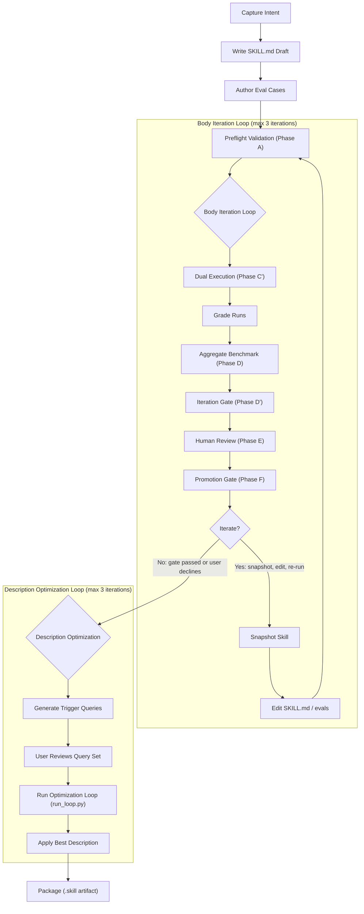

# create-agent-skill

A agent-agnostic, meta-skill for **authoring, evaluating, and iteratively improving** agent skills for coding agents (Cursor CLI, Claude Code, …). It ships an adapter-backed evaluation harness that runs your candidate skill against a baseline, grades the outputs against machine-checkable assertions, and gates promotion on configurable thresholds.

---

## Contents

1. [What the skill is](#what-the-skill-is)
2. [Architecture](#architecture)
3. [Workflow and phase map](#workflow-and-phase-map)
4. [Data contracts and schemas](#data-contracts-and-schemas)
5. [End-to-end example: the `finance-variance` skill, 2 iterations](#end-to-end-example-the-finance-variance-skill-2-iterations)
   1. [Iteration 1 — baseline dual run](#iteration-1--baseline-dual-run)
   2. [Iteration 2 — re-run after skill body improvement](#iteration-2--re-run-after-skill-body-improvement)
6. [Defaults and policy](#defaults-and-policy)
7. [End-to-end workflow: from intent to packaged skill](#end-to-end-workflow-from-intent-to-packaged-skill)
8. [Practical considerations](#practical-considerations)

---

## What the skill is

`create-agent-skill` is a skill that teaches an agent how to turn a fuzzy intent ("I want a skill for X") into a production-grade skill with:

- A clean and validated `SKILL.md` that triggers reliably.
- A machine-checked eval set (`evals/evals.json`).
- Quantitative proof that the skill actually helps (pass-rate lift over a baseline agent).
- A deterministic package (`.skill` zip) ready to install.

It does this by running two agents side by side on every eval: 
- One **with** the skill loaded, 
- The other **without** (or against an **old snapshot**). 

**The delta is the skill's contribution.**

## Architecture

```
.cursor/skills/create-agent-skill/
├── SKILL.md                    # Meta-skill instructions (read by the driving agent)
├── README.md                   # This file
├── config/
│   ├── active_agent            # Single line: which adapter to use (e.g. "cursor")
│   └── thresholds.json         # Promotion thresholds (lift, pass rate, critical failures)
├── adapters/                   # Agent-specific subprocess + transcript parsing
│   ├── base.py                 #   Adapter protocol (invoke_subagent, evaluate_trigger, ...)
│   ├── cursor/                 #   Cursor CLI (`agent`) implementation
│   └── claude_code/            #   Claude Code CLI (`claude -p`) implementation
├── agents/                     # Reusable agent prompts
│   ├── executor.md             #   Default dual-run executor (supports {{SKILL_CONTENT}}, {{USER_INPUT}})
│   ├── grader.md               #   Per-run assertion grading
│   ├── comparator.md           #   Blind A/B comparison
│   └── analyzer.md             #   Post-hoc benchmark analysis
├── eval-harness/
│   ├── scripts/                # Phase C–D commands (run_eval, aggregate_benchmark, ...)
│   └── viewer/                 # Phase E HTML viewer (live or --static)
├── scripts/                    # Phase A, D', F commands (skill validate, gate, package)
└── references/
    ├── execution-contract.md   # The phase→command map
    ├── evaluation.md           # What "dual run" means
    ├── getting-started.md      # Adapter selection
    └── schemas/                # JSON schemas — the source of truth for every artifact
        ├── evals.schema.json
        ├── eval_metadata.schema.json
        ├── grading.schema.json
        ├── benchmark.schema.json
        ├── feedback.schema.json
        ├── timing.schema.json
        └── iteration.schema.json
```

**Core invariant:** core code (everything under `eval-harness/` and `scripts/`) depends only on `adapters/base.py::Adapter`. Agent-specific details (CLI flags, transcript parsing, tokens reporting) live inside `adapters/<name>/`, so adding support for a new agent is ~1 file.

**Skill isolation contract.** The default executor template `agents/executor.md` contains `{{SKILL_CONTENT}}`. The harness substitutes:

| Side            | `{{SKILL_CONTENT}}` value                   |
|-----------------|---------------------------------------------|
| `with_skill`    | Candidate skill's `SKILL.md` (full content) |
| `without_skill` | Empty string                                |
| `old_skill`     | Prior snapshot's `SKILL.md`                 |

This is what makes the comparison meaningful: the baseline agent genuinely does not see the skill.

## Workflow and phase map

All commands run with the `create-agent-skill` root as the current working directory so imports resolve.

| Phase | What happens                                                 | Command                                                                                                                      |
|-------|--------------------------------------------------------------|------------------------------------------------------------------------------------------------------------------------------|
| **A** | Validate `SKILL.md` frontmatter + `evals/evals.json` schema  | `python scripts/quick_validate.py <skill-path>`                                                                              |
| **B** | Author `evals/evals.json` (inputs + expectations)            | (manual edit; validated in A)                                                                                                |
| **C** | Description-trigger eval (optional, for frontmatter tuning)  | `python eval-harness/scripts/run_eval.py trigger --eval-set <file> --skill-path <skill>`                                     |
| **C′**| Dual execution (`with_skill` vs baseline, via the adapter)   | `python eval-harness/scripts/run_eval.py dual --iteration N --workspace <ws>`                                                |
| **D** | Aggregate gradings into `benchmark.json` / `benchmark.md`    | `python eval-harness/scripts/aggregate_benchmark.py --iteration N --workspace <ws> --skill-name <n> --skill-path <p>`        |
| **D′**| Gate iteration artifacts (schemas + assertion-id parity)     | `python scripts/check_iteration.py --iteration N --workspace <ws>`                                                           |
| **E** | Human review — live browser viewer or static HTML            | `python eval-harness/viewer/generate_review.py <ws> --iteration N --skill-name <n> --benchmark <ws>/iteration-N/benchmark.json [--static <path>]` |
| **F** | Promotion gate (`config/thresholds.json`)                    | `python scripts/check_promotion.py --iteration N --workspace <ws>`                                                           |

The description-optimization loop (`run_loop.py`) is a different code path used *after* the body is good. It now defaults to **3 iterations** — see [Defaults and policy](#defaults-and-policy).

Workspace layout produced by the harness:

```
<skill-name>-workspace/
├── grade_iteration.py          # Custom programmatic grader (written during the run)
├── iteration-1-snapshot/       # Snapshot of the skill at the end of iteration 1
│   ├── SKILL.md
│   ├── evals/evals.json
│   └── scripts/compute_variance.py
├── iteration-1/
│   ├── iteration.json          # Manifest (schema: iteration.schema.json) — author writes this
│   ├── benchmark.json          # Aggregated results  (schema: benchmark.schema.json)
│   ├── benchmark.md            # Human-readable table
│   ├── feedback.json           # Human feedback       (schema: feedback.schema.json)
│   └── <eval-id>/
│       ├── eval_metadata.json  # Per-eval metadata    (schema: eval_metadata.schema.json)
│       ├── with_skill/
│       │   └── run-1/
│       │       ├── outputs/    # Files the agent produced (whatever the skill dictates)
│       │       ├── transcript.jsonl   # stream-json log of the agent run
│       │       ├── timing.json        # schema: timing.schema.json
│       │       └── grading.json       # schema: grading.schema.json
│       └── without_skill/      # (or old_skill/)
│           └── run-1/          # Same structure
├── iteration-2/
│   └── ...                     # Same structure as iteration-1
└── ...
```

## Data contracts and schemas

Every artifact written by the harness is validated against a JSON Schema. If your pipeline writes malformed JSON, Phase D′ (`check_iteration.py`) will reject the iteration with a line number. The schemas live in `references/schemas/`:

| Artifact                    | Schema                          | Produced by                             |
|-----------------------------|---------------------------------|-----------------------------------------|
| `evals/evals.json`          | `evals.schema.json`             | Author (manual)                         |
| `iteration-N/iteration.json`| `iteration.schema.json`         | Author (manual)                         |
| `eval_metadata.json`        | `eval_metadata.schema.json`     | `run_eval.py dual`                      |
| `timing.json`               | `timing.schema.json`            | `run_eval.py dual`                      |
| `grading.json`              | `grading.schema.json`           | Grader subagent or deterministic script |
| `benchmark.json`            | `benchmark.schema.json`         | `aggregate_benchmark.py`                |
| `feedback.json`             | `feedback.schema.json`          | Human via viewer                        |

---

## End-to-end example: the `finance-variance` skill, 2 iterations

**Example Skill resources created:**
- The skill directory (`finance-variance/`) is **separate** from the workspace (`finance-variance-workspace/`). 
- Evaluation artifacts never land inside the skill — the skill stays shippable.

**Goal.** Build a skill called `finance-variance` that, given a CSV of `category,budget,actual`, produces a `variance.csv` with columns `category,budget,actual,variance,variance_pct` and a `summary.md` with totals and the top 3 over-budget categories.

### User Prompt
```
  Use the create-agent-skill meta-skill to build and evaluate a new skill called `finance-variance`.

  **What it does:** Given a CSV of monthly budget vs. actuals (`category`, `budget`, `actual`), produce:
  - `variance.csv` with `category, budget, actual, variance, variance_pct` (pct as `"-12.5%"`).
  - `summary.md` with totals and the top 3 over-budget categories.

  **When it should trigger:** budget vs actuals, variance analysis, monthly spend review,
"compare budget to actual" on a CSV. Near-misses count.
  
  **Edge cases to cover across iterations:**
  1. Clean CSV.
  2. Quoted categories containing commas (e.g. `"Travel, domestic"`).
  3. Numeric values with thousands separators (`"1,250.00"`) and trailing blank lines.

  Place the skill at `./.cursor/skills/finance-variance/` and the workspace at `./.cursor/skills/finance-variance-workspace/` (relative to the current project root). 
  
  Use the Cursor adapter. I'll review outputs in the viewer between iterations.
```

**Actual setup produced.**

```
.cursor/skills/
├── finance-variance/                    # The skill under test
│   ├── SKILL.md
│   ├── evals/
│   │   └── evals.json                  # 3 eval cases authored up front
│   └── scripts/
│       └── compute_variance.py          # Bundled helper script
└── finance-variance-workspace/          # All evaluation artifacts land here
    ├── grade_iteration.py               # Programmatic grading script
    ├── iteration-1-snapshot/            # Snapshot of the skill (taken after iteration 1)
    │   ├── SKILL.md
    │   ├── evals/evals.json
    │   └── scripts/compute_variance.py
    ├── iteration-1/
    │   └── ...
    └── iteration-2/
        └── ...
```

All 3 eval cases were authored **up front** in `evals/evals.json` — covering the clean CSV (eval-1), quoted categories (eval-2), and thousands-separators with trailing blanks (eval-3). Both iterations ran all 3 cases.

Phase A runs once up front and any time you edit the skill:

```bash
$ uv run python scripts/quick_validate.py \
    /Users/sshukla/Desktop/src/pydantic-agents/.cursor/skills/finance-variance
Skill is valid!
```

---

### Iteration 1 — baseline dual run

**Goal of the iteration.** Prove the skill's value against "no skill at all" on all three eval cases with the initial skill draft.

**`evals/evals.json`** (3 cases, authored before iteration 1):

```json
[
  {
    "id": 1,
    "eval_id": "eval-1",
    "prompt": "Here's our monthly budget vs. actuals for Q1. Please run a variance analysis and give me variance.csv and summary.md.\n\n```\ncategory,budget,actual\nMarketing,10000,12500\nEngineering,50000,48000\nSales,30000,31500\nHR,15000,14200\nOperations,20000,19800\n```",
    "expectations": [
      { "assertion_id": "variance-csv-exists", "text": "variance.csv exists in the outputs directory", "critical": true },
      { "assertion_id": "summary-md-exists", "text": "summary.md exists in the outputs directory", "critical": true },
      { "assertion_id": "variance-csv-has-5-cols", "text": "variance.csv has exactly the columns: category, budget, actual, variance, variance_pct", "critical": true },
      { "assertion_id": "variance-pct-format", "text": "variance_pct values use the format like '25.0%' or '-4.0%' (one decimal, percent sign, no space)", "critical": true },
      { "assertion_id": "marketing-over-budget", "text": "Marketing row shows variance=2500 and variance_pct=25.0%", "critical": false },
      { "assertion_id": "engineering-under-budget", "text": "Engineering row shows variance=-2000 and variance_pct=-4.0%", "critical": false },
      { "assertion_id": "summary-has-top3", "text": "summary.md lists the top 3 over-budget categories (Marketing, Sales, and one more)", "critical": false },
      { "assertion_id": "summary-has-totals", "text": "summary.md includes a Totals section with Total Budget, Total Actual, Total Variance", "critical": false }
    ],
    "files": []
  },
  {
    "id": 2,
    "eval_id": "eval-2",
    "prompt": "Can you compare our budget to actuals for last month? Some of our department names have commas in them. I need variance.csv and summary.md as output.\n\nHere is the data:\n\n```\ncategory,budget,actual\n\"Travel, domestic\",5000,6200\n\"Software, licenses\",12000,11500\nMarketing,10000,10800\n\"Office, supplies\",3000,2750\nEngineering,40000,38000\n```",
    "expectations": [
      { "assertion_id": "variance-csv-exists", "text": "variance.csv exists in the outputs directory", "critical": true },
      { "assertion_id": "summary-md-exists", "text": "summary.md exists in the outputs directory", "critical": true },
      { "assertion_id": "quoted-category-preserved", "text": "variance.csv contains a row with category 'Travel, domestic' (the comma inside the name is preserved, not treated as a column separator)", "critical": true },
      { "assertion_id": "travel-variance-correct", "text": "The 'Travel, domestic' row has variance=1200 and variance_pct=24.0%", "critical": false },
      { "assertion_id": "row-count-correct", "text": "variance.csv has exactly 5 data rows (one per category)", "critical": true },
      { "assertion_id": "top3-over-budget-in-summary", "text": "summary.md lists Travel, domestic and Marketing as over-budget categories (they are the only two over budget)", "critical": false }
    ],
    "files": []
  },
  {
    "id": 3,
    "eval_id": "eval-3",
    "prompt": "Hey, my finance team just sent over this CSV for the monthly spend review — can you do the variance analysis? It has some formatting quirks (thousands separators in the numbers) and there are blank lines at the end. I need variance.csv and summary.md.\n\n```\ncategory,budget,actual\n\"Marketing\",\"12,500.00\",\"15,000.00\"\n\"Engineering\",\"85,000.00\",\"82,500.00\"\n\"Office, supplies\",\"3,250.00\",\"4,100.00\"\n\"HR\",\"18,000.00\",\"17,500.00\"\n\"Sales\",\"45,000.00\",\"48,750.00\"\n\n\n```",
    "expectations": [
      { "assertion_id": "variance-csv-exists", "text": "variance.csv exists in the outputs directory", "critical": true },
      { "assertion_id": "summary-md-exists", "text": "summary.md exists in the outputs directory", "critical": true },
      { "assertion_id": "thousands-separators-stripped", "text": "variance.csv numeric columns contain plain numbers without thousands separators (e.g. 12500 not 12,500)", "critical": true },
      { "assertion_id": "row-count-correct", "text": "variance.csv has exactly 5 data rows (blank trailing lines are ignored)", "critical": true },
      { "assertion_id": "marketing-variance-correct", "text": "Marketing row shows budget=12500, actual=15000, variance=2500, variance_pct=20.0%", "critical": false },
      { "assertion_id": "office-supplies-quoted-comma", "text": "variance.csv contains a row with category 'Office, supplies' (comma inside name preserved)", "critical": true },
      { "assertion_id": "top3-over-budget-correct", "text": "summary.md top-3 over-budget list includes Marketing, Sales, and Office supplies (the three over-budget categories)", "critical": false }
    ],
    "files": []
  }
]
```

**`iteration-1/iteration.json`:**

```json
{
  "skill_path": "/Users/sshukla/Desktop/src/pydantic-agents/.cursor/skills/finance-variance",
  "evals_path": "/Users/sshukla/Desktop/src/pydantic-agents/.cursor/skills/finance-variance/evals/evals.json",
  "baseline_type": "without_skill",
  "runs_per_configuration": 1,
  "notes": "Iteration 1: initial skill draft. Three eval cases: clean CSV, quoted commas, thousands separators + trailing blanks."
}
```

**Phase C′ — dual execution:**

```bash
$ uv run python eval-harness/scripts/run_eval.py dual \
    --iteration 1 \
    --workspace /Users/sshukla/Desktop/src/pydantic-agents/.cursor/skills/finance-variance-workspace \
    --timeout 180
```

This command produced 6 runs (3 evals × 2 sides). The directory tree below `iteration-1/`:

```
iteration-1/
├── iteration.json
├── benchmark.json
├── benchmark.md
├── feedback.json
├── eval-1/
│   ├── eval_metadata.json
│   ├── with_skill/run-1/
│   │   ├── outputs/
│   │   │   ├── variance.csv
│   │   │   ├── summary.md
│   │   │   ├── compute_variance.py
│   │   │   └── budget.csv
│   │   ├── timing.json
│   │   ├── grading.json
│   │   └── transcript.jsonl
│   └── without_skill/run-1/
│       ├── outputs/
│       │   ├── variance.csv
│       │   └── summary.md
│       ├── timing.json
│       ├── grading.json
│       └── transcript.jsonl
├── eval-2/
│   ├── eval_metadata.json
│   ├── with_skill/run-1/
│   │   └── outputs/ ...        # (same structure)
│   └── without_skill/run-1/
│       └── outputs/ ...
└── eval-3/
    ├── eval_metadata.json
    ├── with_skill/run-1/
    │   └── outputs/ ...
    └── without_skill/run-1/
        └── outputs/ ...
```

`variance.csv` from `with_skill/run-1/outputs/` (eval-1):

```csv
category,budget,actual,variance,variance_pct
Marketing,10000.0,12500.0,2500.0,25.0%
Engineering,50000.0,48000.0,-2000.0,-4.0%
Sales,30000.0,31500.0,1500.0,5.0%
HR,15000.0,14200.0,-800.0,-5.3%
Operations,20000.0,19800.0,-200.0,-1.0%
```

`variance.csv` from `without_skill/run-1/outputs/` (eval-1) — note the extra `status` column, `Total` row, and inverted variance signs (the baseline used `budget − actual` instead of `actual − budget`):

```csv
category,budget,actual,variance,variance_pct,status
Marketing,10000,12500,-2500,-25.0%,Over Budget
Engineering,50000,48000,2000,4.0%,Under Budget
Sales,30000,31500,-1500,-5.0%,Over Budget
HR,15000,14200,800,5.3%,Under Budget
Operations,20000,19800,200,1.0%,Under Budget
Total,125000,126000,-1000,-0.8%,Over Budget
```

**`timing.json`** (with_skill/run-1, eval-1):

```json
{
  "total_duration_seconds": 21.242,
  "total_duration_api_seconds": 21.242,
  "total_tokens": 1859,
  "tokens_detail": {
    "input": 6,
    "output": 1853,
    "cacheReadTokens": 70484,
    "cacheWriteTokens": 6103
  },
  "status": "ok",
  "exit_code": 0
}
```

**Grading** — a programmatic grading script (`grade_iteration.py`) was written at the workspace root to deterministically check all assertions. Output for `with_skill/run-1` eval-1 (`grading.json`):

```json
{
  "expectations": [
    {
      "assertion_id": "variance-csv-exists",
      "text": "variance.csv exists",
      "passed": true,
      "evidence": "Found at iteration-1/eval-1/with_skill/run-1/outputs/variance.csv",
      "critical": true
    },
    {
      "assertion_id": "summary-md-exists",
      "text": "summary.md exists",
      "passed": true,
      "evidence": "Found at iteration-1/eval-1/with_skill/run-1/outputs/summary.md",
      "critical": true
    },
    {
      "assertion_id": "variance-csv-has-5-cols",
      "text": "variance.csv has exactly category, budget, actual, variance, variance_pct",
      "passed": true,
      "evidence": "Columns: ['category', 'budget', 'actual', 'variance', 'variance_pct']",
      "critical": true
    },
    {
      "assertion_id": "variance-pct-format",
      "text": "variance_pct uses format like '25.0%'",
      "passed": true,
      "evidence": "All values match pattern",
      "critical": true
    },
    {
      "assertion_id": "marketing-over-budget",
      "text": "Marketing variance=2500 and variance_pct=25.0%",
      "passed": true,
      "evidence": "variance=2500.0, variance_pct=25.0%",
      "critical": false
    },
    {
      "assertion_id": "engineering-under-budget",
      "text": "Engineering variance=-2000 and variance_pct=-4.0%",
      "passed": true,
      "evidence": "variance=-2000.0, variance_pct=-4.0%",
      "critical": false
    },
    {
      "assertion_id": "summary-has-top3",
      "text": "summary.md lists over-budget categories",
      "passed": true,
      "evidence": "Marketing found in Top 3 section",
      "critical": false
    },
    {
      "assertion_id": "summary-has-totals",
      "text": "summary.md has Totals section",
      "passed": true,
      "evidence": "All total rows found",
      "critical": false
    }
  ],
  "summary": {
    "passed": 8,
    "failed": 0,
    "total": 8,
    "pass_rate": 1.0
  },
  "eval_feedback": {
    "suggestions": [],
    "overall": "Programmatic grading."
  }
}
```

The `without_skill/run-1` eval-1 grading scored 4/8 (50% pass rate). The baseline produced `variance.csv` (so `variance-csv-exists` passed), and the file had the required columns plus an extra `status` column (`variance-csv-has-5-cols` passed as a superset check). However, it used inverted variance signs (`budget − actual` instead of `actual − budget`), so `marketing-over-budget` and `engineering-under-budget` both failed. The summary.md used a different format without the expected "Total Budget" / "Top 3" sections, so those assertions also failed.

**Phase D — aggregate:**

```bash
$ uv run python eval-harness/scripts/aggregate_benchmark.py \
    --iteration 1 \
    --workspace /Users/sshukla/Desktop/src/pydantic-agents/.cursor/skills/finance-variance-workspace \
    --skill-name finance-variance \
    --skill-path /Users/sshukla/Desktop/src/pydantic-agents/.cursor/skills/finance-variance
```

Resulting `benchmark.json` `run_summary` block (actual numbers):

```json
{
  "with_skill": {
    "pass_rate": {
      "mean": 1.0,
      "stddev": 0.0,
      "min": 1.0,
      "max": 1.0
    },
    "time_seconds": {
      "mean": 21.72,
      "stddev": 1.79,
      "min": 20.209,
      "max": 23.701
    },
    "tokens": {
      "mean": 1859,
      "stddev": 14,
      "min": 1845,
      "max": 1873
    }
  },
  "without_skill": {
    "pass_rate": {
      "mean": 0.627,
      "stddev": 0.1125,
      "min": 0.5,
      "max": 0.714
    },
    "time_seconds": {
      "mean": 19.99,
      "stddev": 1.29,
      "min": 18.694,
      "max": 21.282
    },
    "tokens": {
      "mean": 1303,
      "stddev": 210,
      "min": 1172,
      "max": 1545
    }
  },
  "delta": {
    "pass_rate": "+0.37",
    "time_seconds": "+1.7",
    "tokens": "+556"
  }
}
```

**`benchmark.md`** renders as:

```markdown
# Skill Benchmark: finance-variance

**Model**: <model-name>
**Date**: 2026-04-21T21:17:21Z
**Evals**: eval-1, eval-2, eval-3 (1 runs each per configuration)

## Summary

| Metric | With Skill | Without Skill | Delta |
|--------|------------|---------------|-------|
| Pass Rate | 100% ± 0% | 63% ± 11% | +0.37 |
| Time | 21.7s ± 1.8s | 20.0s ± 1.3s | +1.7s |
| Tokens | 1859 ± 14 | 1303 ± 210 | +556 |

_Token counts may read as n/a when the active adapter does not expose usage (D-006)._
```

**Phase D′ — gate:** `check_iteration.py --iteration 1 …` exits 0.

**Phase E — static viewer:**

```bash
$ uv run python eval-harness/viewer/generate_review.py \
    /Users/sshukla/Desktop/src/pydantic-agents/.cursor/skills/finance-variance-workspace \
    --iteration 1 \
    --skill-name finance-variance \
    --benchmark /Users/sshukla/Desktop/src/pydantic-agents/.cursor/skills/finance-variance-workspace/iteration-1/benchmark.json \
    --static /Users/sshukla/Desktop/src/pydantic-agents/.cursor/skills/finance-variance-workspace/iteration-1/review.html
```

**`feedback.json`** (written by the user through the viewer):

```json
{
  "reviews": [
    {
      "run_id": "eval-3-without_skill-run-1",
      "feedback": "Looks great, seems to be working well",
      "timestamp": "2026-04-21T21:20:45.323Z"
    }
  ],
  "status": "complete"
}
```

**What the numbers tell you.** The skill achieved 100% pass rate across all three eval cases. The baseline without the skill scored 63% on average — it could produce the right file names sometimes but used inverted variance signs, invented extra columns, and didn't conform to the required summary structure. The skill costs slightly more in time (+1.7s) and tokens (+556) — it has to write the bundled `compute_variance.py` script — but the determinism is worth it.

**Phase F — promotion gate:** `check_promotion.py --iteration 1 …` -> exits 0: candidate pass 100% ≥ 85%, lift +37pp ≥ 10pp, 0 critical failures, feedback complete.

✅ Iteration 1 passes the promotion gate.

---

### Iteration 2 — re-run after skill body improvement

**Goal.** Fix a formatting issue observed in iteration 1: the `with_skill` agent was outputting floats in `variance.csv` (`10000.0` instead of `10000`). The skill body was updated to ensure the `_fmt_num` function produces integers when the value is whole.

**Change:** The SKILL.md body was updated — specifically the `_fmt_num` helper function and integer formatting behavior in `compute_variance.py`. The eval set (`evals/evals.json`) was **unchanged** — same 3 cases.

**`iteration-2/iteration.json`:**

```json
{
  "skill_path": "/Users/sshukla/Desktop/src/pydantic-agents/.cursor/skills/finance-variance",
  "evals_path": "/Users/sshukla/Desktop/src/pydantic-agents/.cursor/skills/finance-variance/evals/evals.json",
  "baseline_type": "without_skill",
  "runs_per_configuration": 1,
  "notes": "Iteration 2: fix float formatting in variance.csv numeric columns (10000 not 10000.0)."
}
```

Run the same phases. The float formatting fix is visible in the outputs — iteration 2 `with_skill` eval-1 now produces `10000` instead of `10000.0`:

```csv
category,budget,actual,variance,variance_pct
Marketing,10000,12500,2500,25.0%
Engineering,50000,48000,-2000,-4.0%
Sales,30000,31500,1500,5.0%
HR,15000,14200,-800,-5.3%
Operations,20000,19800,-200,-1.0%
```

**`benchmark.md`** (actual):

```markdown
# Skill Benchmark: finance-variance

**Model**: <model-name>
**Date**: 2026-04-21T21:24:58Z
**Evals**: eval-1, eval-2, eval-3 (1 runs each per configuration)

## Summary

| Metric | With Skill | Without Skill | Delta |
|--------|------------|---------------|-------|
| Pass Rate | 100% ± 0% | 63% ± 11% | +0.37 |
| Time | 24.5s ± 2.4s | 20.7s ± 2.0s | +3.8s |
| Tokens | 1998 ± 10 | 1272 ± 232 | +726 |

_Token counts may read as n/a when the active adapter does not expose usage (D-006)._
```

Real `delta` block from `benchmark.json`:

```json
{
  "delta": {
    "pass_rate": "+0.37",
    "time_seconds": "+3.8",
    "tokens": "+726"
  }
}
```

**What the numbers tell you.** The skill still achieves 100% pass rate across all three cases. The baseline without the skill is consistent with iteration 1 — 63% average with the same failure modes (inverted variance signs, extra columns, wrong summary format). The formatting fix didn't change pass rates (both iterations were 100%) but confirmed the skill body improvement works: integers instead of floats.

The `without_skill` baseline continues to fail the same assertions it failed in iteration 1 — in eval-2 and eval-3 it produces 6 data rows instead of 5 (adding a `Total` row), and its variance percentage format uses two decimal places (`24.00%` instead of `24.0%`).

**`feedback.json`** (iteration 2 — review was not completed):

```json
{
  "reviews": [],
  "status": "in_progress"
}
```

The iteration 2 review cycle was not finished — feedback remains in `in_progress` status with no reviews submitted.

**Phase F — promotion gate:** Would require `require_feedback_complete: true` to be satisfied, which it is not since `feedback.json` has `"status": "in_progress"`. The eval run stopped here.

**Phase — package** (once you're happy):

```bash
$ uv run python scripts/package_skill.py \
    /Users/sshukla/Desktop/src/pydantic-agents/.cursor/skills/finance-variance
🔍 Validating skill...
✅ Skill is valid!
  Added: finance-variance/SKILL.md
  Skipped: finance-variance/evals/evals.json
✅ Successfully packaged skill to: ./finance-variance.skill
```

`evals/` is **intentionally excluded** from the package — evals are for development, not end users.

---

## Defaults and policy

- **`--max-iterations 3`** (in `run_loop.py` for description optimization, and as the recommended convention for body iteration). Three iterations is enough to get past the obvious wins without overfitting the training split. Raise it only with a concrete reason.
- **Promotion thresholds** (`config/thresholds.json`):
  ```json
  {
    "min_candidate_pass_rate": 0.85,
    "min_lift_vs_baseline_pp": 10,
    "max_critical_failures": 0,
    "require_feedback_complete": true
  }
  ```
- **Active adapter** (`config/active_agent`): single line, currently `cursor`. Switch to `claude_code` to run the same harness against Claude Code with no other change.
- **Skill isolation**: enforced by `{{SKILL_CONTENT}}` substitution in `agents/executor.md`. If you write a custom `agent_prompt`, it **must** include this placeholder or isolation is lost.

## End-to-end workflow: from intent to packaged skill

This section describes the complete skill-creation pipeline in generic terms. Each stage includes what happens, what artifacts are produced, and who is responsible. Where helpful, the `csv-dedup` skill (built and validated in this repo) is referenced as a concrete example you can cross-reference.

### High-level flow



### Stage 1: Capture intent and interview

The agent reads the `create-agent-skill` SKILL.md, then works with the user to nail down:

- **What** the skill does (input format, output files, transformation logic)
- **When** it should trigger (phrases, near-misses, edge cases)
- **How** success will be measured (file existence, value correctness, format compliance)

The agent may ask clarifying questions. No files are created yet.

> **csv-dedup example:** The user specified "given a CSV with duplicate rows, produce `dedup.csv` and `dedup-report.md`" with 3 edge cases: clean duplicates, whitespace-trimmed comparison, and case-insensitive values.

### Stage 2: Write the skill draft

The agent creates the skill directory with:

- **`SKILL.md`** — YAML frontmatter (`name`, `description`) + markdown body with instructions
- **`scripts/`** (optional) — bundled helper scripts if the skill benefits from deterministic code

```
<skill-name>/
├── SKILL.md
├── evals/           # (created in Stage 3)
│   └── evals.json
└── scripts/         # (optional)
    └── helper.py
```

> **csv-dedup example:** `csv-dedup/SKILL.md` (117 lines) + `scripts/dedup_csv.py` (100 lines) handling whitespace trimming, case-insensitive comparison, and RFC-4180 quoted fields.

### Stage 3: Author eval cases (HITL gate)

The agent drafts 2-4 realistic test prompts and presents them to the user for approval. This is a **human-in-the-loop gate** — evals must not run until the user confirms.

Each eval case in `evals/evals.json` contains:
- **`prompt`** — what a real user would type
- **`expectations`** — structured assertions with `assertion_id`, `text`, and `critical` flag
- **`files`** — optional input files

> **csv-dedup example:** 3 initial evals (clean duplicates, whitespace edge case, mixed-case headers), later expanded to 4 in iteration 2 (added quoted-comma fields). See `csv-dedup/evals/evals.json`.

### Stage 4: Preflight validation (Phase A)

```bash
python scripts/quick_validate.py <path-to-skill>
```

Validates SKILL.md frontmatter (name, description format) and, when present, schema-validates `evals/evals.json` against `references/schemas/evals.schema.json`. Run this after every edit to the skill.

### Stage 5: Body iteration loop

This is the core evaluation cycle. Each iteration follows phases C' through F in sequence.

#### 5a. Write iteration manifest

Create `iteration-N/iteration.json` with skill path, eval path, and baseline type:

```json
{
  "skill_path": "/abs/path/to/<skill-name>",
  "evals_path": "/abs/path/to/<skill-name>/evals/evals.json",
  "baseline_type": "without_skill",
  "runs_per_configuration": 1
}
```

For `old_skill` baselines (comparing against a prior snapshot), also set `old_skill_path`.

#### 5b. Dual execution (Phase C')

```bash
python eval-harness/scripts/run_eval.py dual --iteration N --workspace <workspace>
```

Launches `with_skill` and `without_skill` (or `old_skill`) runs **in parallel** for every eval case. Each run produces:
- `outputs/` — the files the agent generated
- `transcript.jsonl` — full execution log
- `timing.json` — duration, token counts

> **csv-dedup example:** Iteration 1 ran 3 evals x 2 sides = 6 runs. Iteration 2 ran 4 evals x 2 sides = 8 runs.

#### 5c. Grade each run

Either a **programmatic grading script** (preferred for deterministic checks) or a **grader subagent** (via `agents/grader.md`) evaluates each assertion against the outputs and writes `grading.json` per run.

> **csv-dedup example:** `grade_all.py` at the workspace root checks file existence, row counts, whitespace preservation, header order, and report format programmatically.

#### 5d. Aggregate and gate (Phases D, D')

```bash
python eval-harness/scripts/aggregate_benchmark.py --iteration N --workspace <ws> --skill-name <name>
python scripts/check_iteration.py --iteration N --workspace <ws>
```

Produces `benchmark.json` (machine-readable) and `benchmark.md` (human-readable table). The iteration gate validates all artifacts against JSON schemas.

> **csv-dedup example:** Iteration 1 benchmark: 100% vs 100% (evals too easy). Iteration 2 benchmark: 100% vs 84% (+16pp lift) after adding harder assertions.

#### 5e. Human review (Phase E)

```bash
python eval-harness/viewer/generate_review.py <ws> --iteration N --skill-name <name> --benchmark <ws>/iteration-N/benchmark.json
```

Opens a browser-based viewer with:
- **Outputs tab** — prompt, generated files, formal grades, feedback textarea per run
- **Benchmark tab** — pass rates, timing, token usage, per-eval breakdowns

The user reviews and clicks **"Submit All Reviews"**, which writes `feedback.json` with `"status": "complete"`.

#### 5f. Promotion gate (Phase F)

```bash
python scripts/check_promotion.py --iteration N --workspace <ws>
```

Checks against thresholds in `config/thresholds.json`:
- Candidate pass rate >= 85%
- Lift vs baseline >= 10pp
- 0 critical failures in the candidate
- `feedback.json` status is `"complete"`

If the gate passes and the user is satisfied, the body loop ends. If the gate fails or the user wants improvements, proceed to the next iteration.

#### 5g. Between iterations: snapshot, then edit

Before making any changes for the next iteration:

1. **Snapshot** the current skill to `<workspace>/iteration-N-snapshot/` — this preserves the exact version that produced the current results
2. **Edit** the SKILL.md body, bundled scripts, or eval cases based on feedback
3. Re-run preflight validation (Phase A)
4. Start the next iteration at step 5a

> **csv-dedup example:** `iteration-1-snapshot/SKILL.md` preserves the pre-edit version (no whitespace-preservation guidance). The current `csv-dedup/SKILL.md` adds explicit "trim for comparison only, preserve originals" instructions and `csv.DictReader` guidance. The diff confirms the snapshot captured the right state.

### Stage 6: Description optimization loop

After the body is stable, the description optimization loop tunes the `description` field in SKILL.md frontmatter so the skill triggers reliably for real user queries.

#### 6a. Generate trigger eval queries

The agent creates ~20 realistic queries — 10 that **should** trigger the skill and 10 that **should not** (near-misses that share keywords but need different tools). These are saved as a JSON file.

> **csv-dedup example:** `trigger-eval.json` (82 lines) includes queries like *"i have this csv export from salesforce and there are definitely duplicate entries"* (should trigger) and *"can you sort my CSV alphabetically by the last name column"* (should not).

#### 6b. User reviews the query set

The agent fills the HTML template from `assets/eval_review.html` and opens it for the user to edit labels and export the finalized set.

> **csv-dedup example:** `trigger-eval-review.html` was generated at the workspace root.

#### 6c. Run the optimization loop

```bash
python eval-harness/scripts/run_loop.py \
  --eval-set <trigger-eval.json> \
  --skill-path <skill> \
  --model <model-id> \
  --max-iterations 3 \
  --verbose
```

Iterates on the description, testing each candidate against the query set. Reports train/test accuracy per iteration. Converges when accuracy plateaus or hits the iteration cap.

> **csv-dedup example:** The loop converged on iteration 1 with 100% accuracy (12/12 train, 8/8 test) — the original description was already well-calibrated.

#### 6d. Apply the best description

The agent takes `best_description` from the loop output, updates the SKILL.md frontmatter, and shows a before/after diff.

### Stage 7: Package

```bash
python scripts/package_skill.py <path/to/skill-folder>
```

Produces a `.skill` zip artifact. The `evals/` directory is intentionally excluded — evals are for development, not end users.

---

## Artifacts produced at each stage

| Stage | Artifacts | Location |
|-------|-----------|----------|
| Draft | `SKILL.md`, `scripts/` (optional) | `<skill>/` |
| Eval authoring | `evals/evals.json` | `<skill>/evals/` |
| Preflight | stdout ("Skill is valid!") | terminal |
| Dual execution | `outputs/`, `transcript.jsonl`, `timing.json` per run | `<workspace>/iteration-N/<eval-id>/<side>/run-1/` |
| Grading | `grading.json` per run | same as above |
| Aggregation | `benchmark.json`, `benchmark.md` | `<workspace>/iteration-N/` |
| Human review | `feedback.json` | `<workspace>/iteration-N/` |
| Snapshot | full skill copy | `<workspace>/iteration-N-snapshot/` |
| Description opt | `trigger-eval.json`, `trigger-eval-review.html` | `<workspace>/` |
| Package | `<skill-name>.skill` | working directory |

---

## Practical considerations

These observations come from building and validating two skills (`finance-variance` and `csv-dedup`) through the full pipeline.

- **Iteration 1 can produce false confidence.** If all evals pass for both `with_skill` and `without_skill` (0pp lift), the evals are too easy — they don't discriminate. This happened with `csv-dedup` iteration 1 (100% vs 100%). The fix is to harden the eval set: add assertions that test exact output format, edge-case handling, or behaviors the baseline is unlikely to get right. In `csv-dedup`, adding `original-whitespace-preserved` (a critical assertion the baseline fails) and a fourth eval with quoted-comma fields produced a meaningful +16pp lift in iteration 2.

- **The description optimization loop may converge immediately.** If the frontmatter description is already well-written (covers trigger phrases and near-misses), `run_loop.py` finishes in 1 iteration with 100% accuracy. This is correct behavior, not a failure. The `csv-dedup` description triggered correctly for all 20 test queries on the first pass.

- **The `require_feedback_complete` threshold matters.** The promotion gate in `config/thresholds.json` requires `feedback.json` to have `"status": "complete"`. If you skip the viewer review or the feedback file is missing, the gate will fail. Always click "Submit All Reviews" in the viewer before proceeding.

- **Eval IDs are flexible.** The harness accepts both string IDs (`"eval-1"`, `"eval-2"`) and numeric IDs (`1`, `2`, `3`). The `finance-variance` skill used string IDs; `csv-dedup` used numeric IDs. Both work correctly.

- **Bundled scripts pay for themselves.** When the skill includes a deterministic helper script (e.g., `compute_variance.py`, `dedup_csv.py`), the `with_skill` agent consistently produces correct outputs. Without the script, baseline agents reinvent the logic and introduce subtle errors (inverted signs, trimmed whitespace, non-standard formats). The cost is a few extra tokens and seconds per run; the gain is near-perfect reproducibility.

- **Programmatic grading scripts are reusable.** The `grade_all.py` / `grade_iteration.py` scripts written during evaluation can be re-run on any iteration. For skills with deterministic outputs, prefer these over grader subagents — they are faster, cheaper, and perfectly reproducible.

