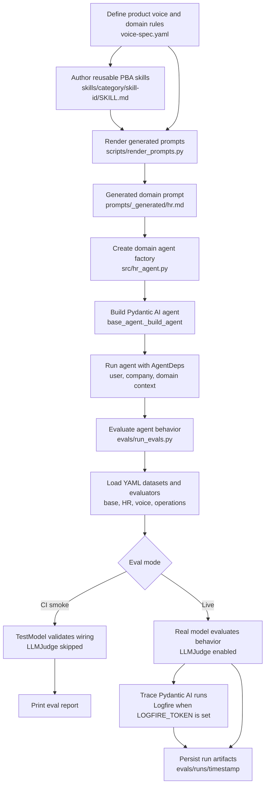

# PBA Agent Fleet POC

This POC explores how Array's existing agentic coding infrastructure can support a
foundational agent development framework for PBA. The framework should help teams
build new customer-facing PBA agents and review existing PBA agents in a reliable,
deterministic, governed, and secure way.

## Existing Array Infrastructure

The current infrastructure uses Cursor coding agents for agent code development:
local agents through the CLI and IDE, and remote agents through Cursor cloud
agents. The agents themselves are built with the Pydantic AI SDK for Python and
deployed in Azure containers.

## Research Questions

### Cursor Agent

- Is Cursor Agent mature enough for scalable agentic development, both locally
  and remotely?
- Does Cursor support capabilities such as hooks, MCPs, skills, and plugins for
  building and distributing reusable coding-agent components across the
  engineering team?
- Does the Cursor hook framework expose enough lifecycle events for auditing and
  gating long-running coding sessions?
- Does Cursor support chaining hooks?
- Do Cursor hooks emit detailed event objects for tool calls, blocked tool calls,
  prompt-injection detection, shell command I/O, prompt compaction, token usage,
  and other data needed to analyze, extract insights from, and troubleshoot
  coding sessions?
- Is Cursor's metadata file system comprehensive enough to isolate and analyze
  cross-session activity?
- What are the discrepancies between Cursor CLI and Cursor IDE agents?
- Does Cursor administration support a private plugin marketplace, so agent
  components such as skills, prompts, and MCPs can be shared across the
  engineering team?

### Infra

- Which evaluation platform gives the most value for money: Logfire, Braintrust,
  or Azure App Insights/Foundry?

### Pydantic AI

- Does the Pydantic AI SDK expose low-level features that support building
  task-specific agent harnesses rather than only general-purpose agent harnesses?
- What models does it support?
- Does the SDK support sandboxing tool execution and network policies?
- Does the Pydantic ecosystem support evals for agent skills and prompts?
- Does the Pydantic ecosystem support observability frameworks for tracking and
  debugging agent trajectories?
- Does Pydantic have native support for orchestrating agents, especially
  long-running agents?
- Support for prompt caching?

### Agentic Product Development

- Can we build a meta agent skill, `create-agent-skill`, for creating new agent
  skills with an end-to-end evaluation pipeline that measures quantitative and
  qualitative metrics, uses LLM-as-a-judge, and includes evaluation-optimizer
  loops to improve the skill body and description?
- Can `create-agent-skill` be coding-agent agnostic, so it is compatible with
  multiple coding agents such as Cursor, Claude Code, and others?
- Can we use `create-agent-skill` to create the following agent skills:
  1. **create-pba-agent**: Streamline a deterministic approach to creating new
     PBA agents and reviewing existing agents.
  2. **pba-product-voice**: Embed Array Product voice and review and evaluate
     existing agents for product-voice conformity.
- Can `pba-product-voice` be converted to a system prompt and maintain the same quality?

## Todo

**1. Cursor Hook Framework**

- Create and chain hooks for multiple lifecycle events.
- Block dangerous commands.
- Generate audit logs for shell commands, prompt-injection attacks, token usage,
  and related events.
- Provide a [dashboard](tmp/cursor-analytics-dashboard/bundle.html) for viewing
  the audit log.

**2. Meta Agent Skill - create-agent-skill**

- Create a meta skill that can create, improve, and evaluate agent skills for
  both development and PBA agents.
- Build an adapter-based harness compatible with coding agents such as Cursor
  (default) and Claude Code.
- Isolate the core business logic for creating and evaluating agent skills from
  agent-specific configuration.
- Build an evaluation pipeline for improving agent skill content and trigger
  descriptions.

**3. PBA Base Agent**

- Design a standardized system prompt with distinct sections separated by XML
  tags.
- [Embed Array Product Voice (SoT)](./pba-agent/voice-spec/voice-spec.yaml):
  - Derived from official Array Product voice docs.
  - Input source for building and evaluating PBA agents.
- Add OTel integration, with Jaeger for local use.
- Add Pydantic Evals datasets and evaluators.
- Add [base agent evaluation cases](./pba-agent/evals/datasets/base_agent_cases.yaml).
- Add Pydantic Logfire.

**4. Creating domain agent extending PBA base agent**

- Build an agent skill for creating a PBA domain-specific agent: HR Agent.
- Auto-generate the HR Agent system prompt by composing the base prompt with
  HR-specific instructions.
- Add [HR agent evaluation cases](./pba-agent/evals/datasets/hr_agent_cases.yaml).

## PBA Agent Fleet - Implementation Summary

### What's Implemented

- Voice source of truth: structured YAML spec with 8 rules plus the HR domain
  definition, used to drive all prompts.
- Deterministic prompt renderer: YAML to Markdown with byte-identical
  re-renders.
- Skill authoring system: customer-facing skills live under
  `pba-agent/skills/<category>/<id>/SKILL.md` and are inlined into prompts at
  render time.
- First skill: `skill-ai-disclosure-external`, a legal AI-disclosure rule for
  SMS and email, authored and evaluated end-to-end with the
  `create-agent-skill` harness and gated by promotion thresholds: 100% candidate
  versus 69% baseline.
- HR agent: live and answers HR questions on-voice.
- Eval pipeline: voice rules tested with LLMJudge rubrics on the HR agent
  against 8 cases, plus a minimal HR domain dataset with 2 cases. Both are wired
  into `run_evals.py`.
- Live verification: HR 100% and Voice 96% pass rate, with one real
  never-fabricate regression surfaced for Phase 2 work.

## End-to-End Domain Agent Workflow

1. Define shared product-voice rules and domain-specific extensions in
   `pba-agent/voice-spec/voice-spec.yaml`.
2. Add any reusable behavior as a PBA skill under
   `pba-agent/skills/<category>/<skill-id>/SKILL.md`, then reference it from
   the domain's `skills_enabled` list.
3. Run `uv run python pba-agent/scripts/render_prompts.py` to compose the base
   prompt, applicable voice rules, domain extension text, and enabled skills
   into `pba-agent/prompts/_generated/<domain>.md`.
4. Create a domain factory such as `create_hr_agent()` that reads the generated
   prompt and calls the shared `_build_agent()` helper with the domain's
   `AgentSpec`.
5. `_build_agent()` constructs the Pydantic AI agent, attaches model settings,
   tools or output types when needed, and injects runtime context from
   `AgentDeps`.
6. Run evals through `pba-agent/evals/run_evals.py`. Default mode uses
   `TestModel` for deterministic wiring checks; `--live` runs the real model,
   enables LLM judges, saves reports under `pba-agent/evals/runs/`, and sends
   traces to Logfire when `LOGFIRE_TOKEN` is configured.
